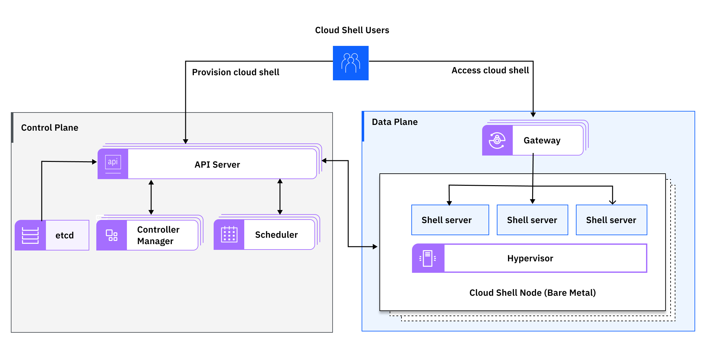

---

copyright:
  years: 2020
lastupdated: "2020-10-19"

keywords: IBM Cloud Shell, cloud shell, workload isolation, cloud shell architecture, cloud shell control plane, cloud shell data plane, cloud shell service, public isolation for cloud shell, compute isolation for cloud shell, cloud shell architecture, workload isolation in cloud shell

subcollection: cloud-shell

---

{{site.data.keyword.attribute-definition-list}}

# Learning about {{site.data.keyword.cloud-shell_notm}} architecture and workload isolation
{: #compute-isolation}

Review the sample architecture for {{site.data.keyword.cloud-shell_full}}, and learn more about different isolation levels. You can then choose the solution that best meets the requirements of the workloads that you want to run in the cloud.

## {{site.data.keyword.cloud-shell_notm}} architecture
{: #architecture}

{{site.data.keyword.cloud-shell_notm}} is a public, multi-tenant regional service that is available in {{site.data.keyword.cloud}}. With {{site.data.keyword.cloud-shell_short}}, you can manage {{site.data.keyword.cloud_notm}} resources and applications in a cloud-hosted shell environment from any web browser, with one click from the {{site.data.keyword.cloud_notm}} console. 

{: caption="Figure 1. Cloud Shell sample architecture" caption-side="bottom"}

The {{site.data.keyword.cloud-shell_short}} control plane is responsible for provisioning {{site.data.keyword.cloud-shell_short}} servers and managing the lifecycle.

- The API server provides an API interface to the {{site.data.keyword.cloud-shell_short}} service.
- The controller manager manages the lifecycle of the {{site.data.keyword.cloud-shell_short}} servers.
- The scheduler finds the best node that the {{site.data.keyword.cloud-shell_short}} server is provisioned on. 

The {{site.data.keyword.cloud-shell_short}} data plane is hosting the user's {{site.data.keyword.cloud-shell_short}} servers. 

- The gateway is operating at the edge to manage the access and route the user's requests to the {{site.data.keyword.cloud-shell_short}} server that is provisioned for the user.
- The {{site.data.keyword.cloud-shell_short}} server is a virtual machine that is running on a bare metal server. 

## {{site.data.keyword.cloud-shell_notm}} workload isolation
{: #workload-isolation}

Each regional deployment of the {{site.data.keyword.cloud-shell_notm}} serves multiple tenants. It is accessed through public endpoints. All the data at rest is encrypted by IBM keys. Data in transit is encrypted by using TLS.

The user's {{site.data.keyword.cloud-shell_short}} server is running in a virtual machine. It is isolated from the other user's {{site.data.keyword.cloud-shell_short}} server that is running on the same node. {{site.data.keyword.cloud-shell_short}} servers that are running on the same node share physical resources such as CPU, memory, and I/O devices. The guest OS in an individual {{site.data.keyword.cloud-shell_short}} server cannot detect any device other than the virtual devices that are made available to it. 

The networks of the {{site.data.keyword.cloud-shell_short}} servers are isolated from each other. Direct traffic is not allowed between {{site.data.keyword.cloud-shell_short}} servers. The {{site.data.keyword.cloud-shell_short}} server can access only the public internet. 
