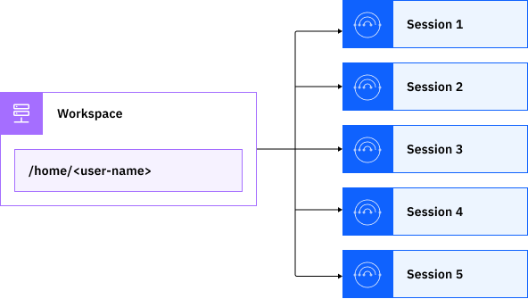

---

copyright:
  years: 2020, 2025
lastupdated: "2025-02-12"

keywords: cloud shell terminal, cloud shell session, cloud shell usage limit, restart cloud shell, cloud shell workspace, cloud shell cookies

subcollection: cloud-shell

---

{{site.data.keyword.attribute-definition-list}}

# Working in {{site.data.keyword.cloud-shell_short}}
{: #shell-ui}

{{site.data.keyword.cloud-shell_full}} contains a personal workspace and sessions where you can run commands. You can open up to five concurrent sessions, which operate independently so you can work with different resources, regions, and accounts at once.
{: shortdesc}

To open {{site.data.keyword.cloud-shell_short}}, click the {{site.data.keyword.cloud-shell_notm}} icon  in the {{site.data.keyword.cloud_notm}} console. A session starts and automatically logs you in to the {{site.data.keyword.cloud_notm}} CLI with your current account.

## Your {{site.data.keyword.cloud-shell_short}} workspace
{: #shell-workspace}

Each time that you open {{site.data.keyword.cloud-shell_short}}, you connect to your {{site.data.keyword.cloud-shell_short}} workspace. A workspace is a dedicated environment that holds your user and session data and provides temporary storage for you to work with files. Workspaces are separate for each user, account, and region, which each run in their own virtual machine. Only you can access your workspace, and if you're a user in multiple accounts, you have separate workspaces for each account, which keeps your data that is isolated and secure. For more information about storing data in {{site.data.keyword.cloud-shell_short}}, see [Temporary workspace storage](/docs/cloud-shell?topic=cloud-shell-files#file-persistence).

## Deleting your {{site.data.keyword.cloud-shell_short}} workspace
{: #shell-workspace-delete}

Deleting your Cloud Shell workspace ends and deletes all sessions in the workspace. All files and data within the workspace are erased. Before you delete the workspace, download any files that you want to keep.

To delete your {{site.data.keyword.cloud-shell_short}} workspace, complete the following steps:

1. Download any files that you want to keep.
1. From your {{site.data.keyword.cloud-shell_short}} workspace, click the **Actions** icon , and then select **Delete**.
1. In the confirmation window, click **Delete**. A blank page is displayed.
1. Click the **Add** icon  to open a new {{site.data.keyword.cloud-shell_short}} session. This action also creates a new {{site.data.keyword.cloud-shell_short}} workspace.

## Working with sessions
{: #shell-env}

A {{site.data.keyword.cloud-shell_short}} session is the terminal interface where you can run commands, scripts, and other tools. It's similar to the command prompt on your local machine, but it's preconfigured with the full {{site.data.keyword.cloud_notm}} CLI and numerous [plug-ins and tools](/docs/cloud-shell?topic=cloud-shell-plugins-tools) so that you can work in {{site.data.keyword.cloud_notm}} without having to install anything. For more information about the CLI, see [Getting started with the {{site.data.keyword.cloud_notm}} CLI](/docs/cli?topic=cli-getting-started).

When you open a session, you start in your {{site.data.keyword.cloud-shell_short}} workspace's home directory, `/home/<user-name>`. Your home directory provides a temporary place for you to work with files in {{site.data.keyword.cloud-shell_short}}. It is shared between all of your sessions. Because data in your home directory isn't persisted, any files that you add or change are removed after two hours of inactivity. For more information about your {{site.data.keyword.cloud-shell_short}} workspace and home directory, see [Working with files](/docs/cloud-shell?topic=cloud-shell-files).

{: caption="Your personal workspace and sessions in Cloud Shell" caption-side="bottom"}

### Opening sessions
{: #multi-shell}
{: support}

To open a new session, click the Open icon . You can have up to five sessions open at one time. Each session maintains separate command histories, which are removed when you close the session. Because the workspace storage is shared between sessions, you can save a file to your home directory in one session, and then open the file in another session.

Each session automatically closes if it's not used for an hour. If you don't use {{site.data.keyword.cloud-shell_short}} for two hours - that is, another hour after the last session is closed - all files and data in your {{site.data.keyword.cloud-shell_short}} workspace are erased. If you need to step away from {{site.data.keyword.cloud-shell_short}}, be sure to download any files that you want to keep. For more information, see [Working with files](/docs/cloud-shell?topic=cloud-shell-files).
{: tip}

## Switching accounts
{: #switch-accounts}
{: support}

When you open a session, you're logged in with the {{site.data.keyword.cloud_notm}} CLI targeting the account and region that you were in when you opened {{site.data.keyword.cloud-shell_short}}. This account and region are the default for every session.

To switch the default account for your sessions, close {{site.data.keyword.cloud-shell_short}}, switch to a different account in the {{site.data.keyword.cloud_notm}} console menu bar, and then reopen {{site.data.keyword.cloud-shell_short}}.

Because you have separate workspaces for each account, your session history and temporary file storage are also separate. This means that when you switch accounts, you see different session tabs and don't have access to any files that you were working with in the previous account.

## Changing locations
{: #change-location}

{{site.data.keyword.cloud-shell_short}} runs in the Dallas (`us-south`) and Frankfurt (`eu-de`) regions. Each {{site.data.keyword.cloud-shell_short}} location operates independently, which means that your workspace storage, sessions, and usage are separate. When you work in {{site.data.keyword.cloud-shell_short}}, the location that you're in determines the following aspects:

- Where your workspace data is stored, including any files that you upload and your user data, such as your session history and usage quota
- The default region that's targeted by the {{site.data.keyword.cloud_notm}} CLI: `us-south` or `eu-de`

By default, the location that's closest to you geographically is selected when you open {{site.data.keyword.cloud-shell_short}} from the console. For example, if you're in California then {{site.data.keyword.cloud-shell_short}} opens to the Dallas region, but if you're in Paris it opens to the Frankfurt region.

To change to {{site.data.keyword.cloud-shell_short}} in a different location, find the current location in the {{site.data.keyword.cloud-shell_short}} menu bar, and click **Change**. Select the location that you want to switch to, and click **OK**.

If you change from the default location, {{site.data.keyword.cloud-shell_short}} remembers your location preferences by saving them as cookies in your browser. If you switch to a different browser, clear your browser cookies, or your [cookie preferences](/#cookie-preferences) don't allow personalization cookies, {{site.data.keyword.cloud-shell_short}} opens in the default location.

## Restarting {{site.data.keyword.cloud-shell_short}}
{: #shell-restart}
{: support}

When you restart {{site.data.keyword.cloud-shell_short}}, any open sessions are closed and all of your files and data are removed. Before you restart, be sure that you download any files that you want to keep to your local system.

To restart, click the Menu icon , and select **Restart**.

## Tracking your usage
{: #usage-limit}

You can use {{site.data.keyword.cloud-shell_short}} for up to 50 hours within a week per region. Anytime that you have at least one open session counts toward this usage quota, even if you aren't actively running commands. For example, if you're working in {{site.data.keyword.cloud-shell_short}} for 15 minutes and then leave your session open for a 30-minute lunch break, those 45 minutes are counted as usage. If you have three sessions open at the same time over an hour period, your usage is one hour because concurrent sessions don't count as additional usage. To minimize your usage, be sure to close sessions after you're done using them.

If you use all of your quota, your {{site.data.keyword.cloud-shell_short}} sessions are closed. Closing {{site.data.keyword.cloud-shell_short}} removes any data in your workspace, including your files and command history.

When you reach your usage quota, you get a notification that {{site.data.keyword.cloud-shell_short}} will close in 5 minutes. Use this time to complete any urgent tasks.
{: tip}

At any point, you can track your usage and check when your weekly quota resets. In the {{site.data.keyword.cloud-shell_short}} menu bar, click the Menu icon , and select **Usage quota**. You can view how many hours you used {{site.data.keyword.cloud-shell_short}} during the current weekly period and the day and time when it resets.

The time that you used of the 50-hour usage quota resets back to 0 at the same time each week. Even after you used all of your quota, you can still use {{site.data.keyword.cloud-shell_notm}} for up to 5 minutes at a time to complete quick tasks, such as to run a few simple commands.

{{site.data.keyword.cloud-shell_notm}} is intended for {{site.data.keyword.cloud_notm}} administration and development purposes. Any usage outside of these guidelines might result in your access to {{site.data.keyword.cloud-shell_notm}} or {{site.data.keyword.cloud_notm}} being suspended. Because {{site.data.keyword.cloud-shell_short}} is intended for interactive purposes only, long-running processes are stopped. For more information, see the [{{site.data.keyword.cloud_notm}} Terms and Notices](/docs/overview?topic=overview-terms).
{: note}

## Changing your cookie preferences
{: #cookie-preferences}

In {{site.data.keyword.cloud-shell_short}}, browser cookies are used to provide a secure login and remember some preferences, such as if you change the default location. Additional cookies are used to build a more personalized experience for you and provide better support. 

{{site.data.keyword.cloud-shell_short}} uses the cookie preferences from the {{site.data.keyword.cloud_notm}} console. If you change your cookie settings from the IBM standard default, your {{site.data.keyword.cloud-shell_short}} location preferences aren't saved, and you might not be able to use some {{site.data.keyword.cloud_notm}} console features.

To change your {{site.data.keyword.cloud_notm}} cookie preferences from within {{site.data.keyword.cloud-shell_short}}, click the Menu icon , and select **Privacy**. For more information, see [Changing your cookie settings](/docs/account?topic=account-usersettings#tracking).
